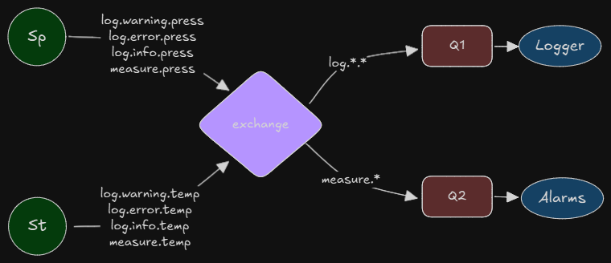

# Arquitetura

O diagrama a seguir ilustra a arquitetura do sistema:

Os principais componentes representados no diagrama são:

- **Sp**: Sensor de pressão
- **St**: Sensor de temperatura
- **Logger**: Registrador de ações e eventos
- **Alarms**: Módulo responsável por disparar notificações

# Papéis

Os sensores **Sp** e **St** têm a função de realizar medições e gerar logs de diferentes níveis de severidade: **warning**, **error** e **info**. As medições são publicadas em tópicos no formato `measures.<sufixo>`, e os logs nos tópicos `log.info.<sufixo>`, `log.warning.<sufixo>` e `log.error.<sufixo>`. O sufixo identifica de qual sensor a informação foi gerada, sendo `temp` para o sensor de temperatura (**St**) e `press` para o sensor de pressão (**Sp**).

O **Logger** é responsável por receber mensagens dos tópicos `log.*.*`, onde o segundo componente do nome do tópico indica o tipo de log gerado (warning, error ou info), e o terceiro componente é o sufixo que identifica o sensor. O Logger então expõe essas informações ao usuário.

O módulo de **Alarms** monitora as mensagens dos tópicos `measures.*` e notifica o usuário caso alguma medição exceda os limites estabelecidos para alarmes de valor máximo ou mínimo. Ele também utiliza o sufixo para identificar a origem da medição.

# Assinatura

Para garantir a integridade e autenticidade das informações transmitidas pelos sensores aos consumidores, cada sensor utiliza um par de chaves, composto por uma chave privada e uma chave pública, durante o processo de envio de mensagens.

- O sensor de pressão (**Sp**) utiliza a chave privada **Kp_priv.pem** para assinar suas mensagens.
- O sensor de temperatura (**St**) utiliza a chave privada **Kt_priv.pem** para assinar suas mensagens.

As mensagens são assinadas combinando a chave privada do sensor com o cálculo de um hash da mensagem. Os consumidores, por sua vez, usam as respectivas chaves públicas dos sensores:

- **Kp_pub.pub** para validar mensagens do sensor de pressão.
- **Kt_pub.pub** para validar mensagens do sensor de temperatura.

Os sufixos dos tópicos (`press` para o sensor de pressão e `temp` para o sensor de temperatura) são utilizados pelos consumidores para identificar a origem da mensagem e determinar qual chave pública deve ser usada para verificar a assinatura. Esse processo assegura que a integridade da mensagem não foi comprometida e que a mensagem realmente foi emitida pelo sensor indicado.